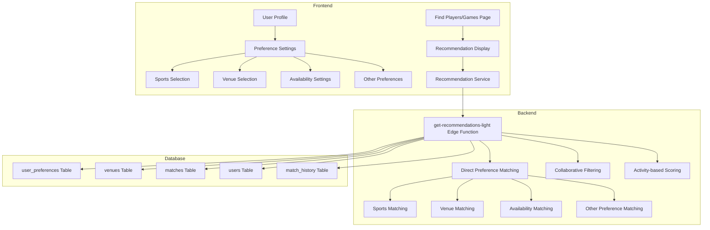

# Sportea Recommendation System Documentation

## Table of Contents

1. [Overview](#overview)
2. [System Architecture](#system-architecture)
3. [Core Components](#core-components)
4. [Database Schema](#database-schema)
5. [Recommendation Algorithm](#recommendation-algorithm)
6. [User Preference Structure](#user-preference-structure)
7. [Frontend Integration](#frontend-integration)
8. [Performance Considerations](#performance-considerations)
9. [Testing Strategy](#testing-strategy)
10. [Deployment Process](#deployment-process)
11. [Future Enhancements](#future-enhancements)

## Overview

The Sportea recommendation system provides personalized match and player recommendations based on user preferences and behavior. The system has evolved from a complex embedding vector-based approach to a simpler, more maintainable direct preference matching system that offers:

- **Simplicity**: Direct preference matching is more intuitive and easier to maintain
- **No external dependencies**: No need for OpenAI or other external APIs
- **Transparency**: Users and developers can better understand why recommendations are made
- **Performance**: Faster computation compared to vector similarity calculations
- **Flexibility**: Easily adjustable weights for different factors in the scoring algorithm
- **Reliability**: Fewer moving parts means fewer potential points of failure

## System Architecture

The recommendation system consists of three main components working together to provide personalized recommendations:



## Core Components

### Frontend Components

- **User Profile**: Central hub for user information and preferences
  - Displays user personal information (username, full name, gender)
  - Shows faculty, state, bio, and profile image
  - Lists sports preferences with skill levels
  - Displays additional preferences (age range, duration)

- **Preference Settings**: Interface for users to set their preferences
  - Sports Selection: Users select their favorite sports
  - Venue/Facility Selection: Users select preferred venues
  - Availability Settings: Users set available days and hours
  - Other Preferences: Group size, match duration, play style, age range

- **Find Players/Games Pages**: Where recommendations are displayed
  - Shows match/player recommendations with scoring information
  - Provides detailed cards with match information
  - Includes filtering options based on preferences

- **Recommendation Service**: JavaScript service that calls the backend Edge Function
  - Handles caching and retry logic
  - Supports multiple recommendation modes
  - Provides diagnostic information for debugging

### Backend Components

- **get-recommendations-light Edge Function**: Main recommendation processing function
  - Fetches user preferences from database
  - Retrieves potential matches
  - Calculates match scores
  - Returns sorted recommendations with scoring details

- **Recommendation Algorithm**: Consists of three weighted components:
  - Direct Preference Matching (60%): Directly compares user preferences with potential matches
  - Collaborative Filtering (30%): Identifies patterns based on similar users' behaviors (future implementation)
  - Activity-based Scoring (10%): Accounts for user activity and engagement history (future implementation)

### Database Components

- **user_preferences Table**: Stores user preferences including favorite sports and venue IDs
- **venues Table**: Stores venue information with IDs and categories
- **matches Table**: Stores information about games/matches
- **users Table**: Stores user information including profile data and preferences
- **match_history Table**: Stores past match data for collaborative filtering
- **user_engagement Table**: Tracks user interactions beyond actual game participation
- **match_ratings Table**: Collects feedback after matches are completed

## Database Schema

### User Table Extensions
```sql
ALTER TABLE public.users 
  ADD COLUMN available_days JSONB,           -- Array of days ["Monday", "Wednesday", "Friday"]
  ADD COLUMN available_hours JSONB,          -- Object with start/end times {start: "14:00", end: "18:00"}
  ADD COLUMN preferred_facilities JSONB,     -- Array of facility IDs
  ADD COLUMN home_location JSONB,            -- {latitude: x, longitude: y, address: "text"}
  ADD COLUMN gender TEXT,                    -- "Male", "Female", "Other", "Prefer not to say"
  ADD COLUMN play_style TEXT,                -- "Casual", "Competitive"
  ADD COLUMN age_range_preference VARCHAR,   -- "18-21", "21-25", "25-30", "30+"
  ADD COLUMN participant_count_preference VARCHAR, -- "small", "medium", "large"
  ADD COLUMN duration_preference VARCHAR;    -- "Less than 1 hour", "1 hour", "2 hours", "2+ hours"
```

### User Preferences Table
```sql
CREATE TABLE IF NOT EXISTS user_preferences (
  id UUID PRIMARY KEY DEFAULT uuid_generate_v4(),
  user_id UUID REFERENCES auth.users(id) ON DELETE CASCADE,
  favorite_sports TEXT[] DEFAULT '{}',
  preferred_venues TEXT[] DEFAULT '{}',
  preferred_days TEXT[] DEFAULT '{}',
  preferred_times TEXT[] DEFAULT '{}',
  preferred_group_size INT DEFAULT 5,
  preferred_skill_level TEXT DEFAULT 'intermediate',
  preferred_match_frequency TEXT DEFAULT 'weekly',
  created_at TIMESTAMP WITH TIME ZONE DEFAULT NOW(),
  updated_at TIMESTAMP WITH TIME ZONE DEFAULT NOW()
);
```

### Match History Table
```sql
CREATE TABLE IF NOT EXISTS match_history (
  id UUID PRIMARY KEY DEFAULT uuid_generate_v4(),
  user_id UUID REFERENCES auth.users(id) ON DELETE CASCADE,
  match_id UUID NOT NULL,
  venue_id UUID REFERENCES venues(id),
  match_date TIMESTAMP WITH TIME ZONE NOT NULL,
  sport_type TEXT NOT NULL,
  group_size INT NOT NULL,
  created_at TIMESTAMP WITH TIME ZONE DEFAULT NOW(),
  updated_at TIMESTAMP WITH TIME ZONE DEFAULT NOW()
);
```

## Recommendation Algorithm

The recommendation system uses a weighted algorithm consisting of three major components:

### 1. Direct Preference Matching (60% of total score)

Direct preference matching compares user preferences directly with potential matches:

- **Sports Matching (50% of direct matching score)**:
  - Direct match: 1.0
  - No match: 0.1
  - No preference: 0.5 (neutral)

- **Venue Matching (20% of direct matching score)**:
  - Direct match: 1.0
  - No match: 0.3
  - No preference: 0.5 (neutral)

- **Schedule Matching (15% of direct matching score)**:
  - Day match: 0.0-1.0 based on preferred days
  - Time match: 0.0-1.0 based on preferred times
  - No preference: 0.5 (neutral)

- **Other Preferences Matching (15% of direct matching score)**:
  - Group size: 0.0-1.0 based on difference from preferred size
  - Skill level: 0.0-1.0 based on skill level match
  - No preference: 0.5 (neutral)

### 2. Collaborative Filtering (30% of total score - Future Implementation)

Collaborative filtering will identify patterns based on similar users' behaviors:

- **User-Based Collaborative Filtering**
  - Identifies users with similar preferences and behaviors
  - Recommends games/players that similar users have enjoyed

- **Item-Based Collaborative Filtering**
  - Identifies games/players with similar characteristics
  - Recommends items similar to ones the user has positively engaged with

### 3. Activity-Based Scoring (10% of total score - Future Implementation)

Activity-based scoring will account for user's own history and engagement:

- **Data Collection**
  - match_history table records all user participation in games/matches
  - user_engagement table tracks interactions beyond actual game participation
  - match_ratings table collects feedback after matches are completed

## User Preference Structure

The system collects and utilizes the following user preferences:

- **Profile Information**
  - Gender: Used for direct matching and potential gender preference matching
  - Faculty: For academic background matching
  - State: For location-based matching
  - Age Range Preference: For age group matching

- **Sports Preferences**
  - Favorite Sports: Critical for sport type matching
  - Skill Levels: For matching appropriate skill levels

- **Scheduling Preferences**
  - Available Days: Days of the week user is available to play
  - Available Hours: Times during the day user is available

- **Venue Preferences**
  - Preferred Facilities: Specific venues the user prefers to play at

- **Play Style Preferences**
  - Play Style: Casual or competitive
  - Duration Preference: Preferred match duration
  - Group Size Preference: Preferred number of participants

## Frontend Integration

The recommendation system is integrated into the frontend through:

1. **User Profile Pages**: Allow users to set and update their preferences
   - ProfileEdit.jsx: For editing preferences
   - Profile.jsx: For displaying current preferences
   - Register.jsx: For capturing initial preferences

2. **Recommendation Service**: Handles communication with the backend
   - Calls the appropriate Edge Function
   - Manages caching for performance
   - Handles errors and retries

3. **Recommendation Display Components**: Show the recommendations
   - RecommendationsList.jsx: Displays a list of recommendations
   - RecommendationCard.jsx: Shows individual recommendation with score details

## Performance Considerations

To ensure optimal performance, the recommendation system implements:

1. **Caching Strategy**:
   - Client-side caching of recommendations with configurable TTL
   - Request throttling to prevent excessive API calls

2. **Database Optimizations**:
   - Appropriate indexes on frequently queried columns
   - Optimized queries for recommendation calculations

3. **Lightweight Implementation**:
   - Simple, direct matching algorithms instead of complex vector operations
   - Minimal external dependencies

## Testing Strategy

The recommendation system is tested using:

1. **Unit Testing**:
   - Testing individual components of the recommendation algorithm
   - Verifying scoring functions produce expected results

2. **Integration Testing**:
   - Testing the complete recommendation flow
   - Verifying database interactions

3. **Performance Testing**:
   - Measuring response times for recommendation requests
   - Testing with different numbers of potential matches

4. **User Testing**:
   - Validating recommendation quality with real users
   - Gathering feedback on recommendation relevance

## Deployment Process

The deployment process for the recommendation system follows these steps:

1. **Database Migration**:
   - Running migration scripts to update schemas
   - Verifying data integrity after migration

2. **Edge Function Deployment**:
   - Deploying the get-recommendations-light function
   - Testing functionality and error handling

3. **Frontend Integration**:
   - Updating frontend components to use the new system
   - Implementing fallback mechanisms

4. **Monitoring Setup**:
   - Setting up logging for the recommendation system
   - Creating alerts for potential issues

## Future Enhancements

Planned enhancements to the recommendation system include:

1. **Collaborative Filtering Implementation**:
   - User similarity calculation
   - Pre-computing similarity matrices
   - User neighborhood generation

2. **Activity-Based Scoring**:
   - Activity data collection
   - Recency weighting function
   - Engagement pattern analysis

3. **Advanced Features**:
   - Caching strategy for recommendations
   - Pagination for recommendation results
   - Fine-tuning scoring weights based on user feedback
   - A/B testing framework for algorithm optimization 