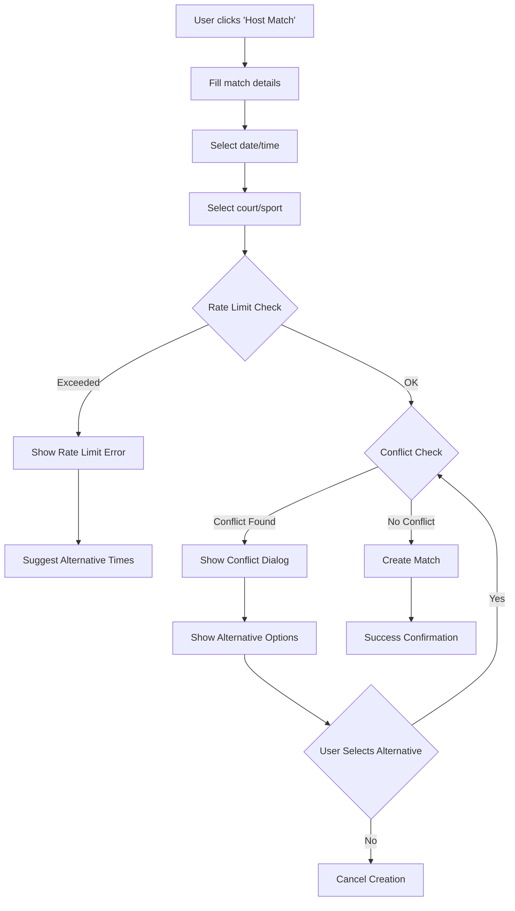

# Smart Rate Limiting and Court Booking Conflict Prevention System

## Overview

This document outlines the implementation of a comprehensive smart rate limiting system combined with court booking conflict prevention for the Sportea sports matching application. The system prevents users from gaming the Community Builder Score while ensuring fair court allocation and preventing double bookings.

## Table of Contents

1. [System Architecture](#system-architecture)
2. [Smart Rate Limiting](#smart-rate-limiting)
3. [Court Booking Conflict Prevention](#court-booking-conflict-prevention)
4. [User Experience Flow](#user-experience-flow)
5. [Database Schema](#database-schema)
6. [Implementation Guidelines](#implementation-guidelines)
7. [API Endpoints](#api-endpoints)
8. [Error Handling](#error-handling)
9. [Testing Strategy](#testing-strategy)

## System Architecture

### Core Components

1. **Rate Limiting Engine**: Tracks user hosting frequency and enforces limits
2. **Conflict Detection Service**: Checks for court/sport/time conflicts
3. **Validation Pipeline**: Multi-layer validation before match creation
4. **User Notification System**: Provides clear feedback on conflicts and limits

### Technology Stack

- **Backend**: Supabase PostgreSQL with RLS policies
- **Rate Limiting**: Redis-like caching with Supabase functions
- **Conflict Detection**: Database triggers and constraints
- **Frontend**: React with real-time validation

## Smart Rate Limiting

### Rate Limiting Rules

```javascript
const RATE_LIMITS = {
  hosting: {
    daily: {
      max: 2,
      window: 24 * 60 * 60 * 1000, // 24 hours
      resetTime: '00:00:00' // Midnight UTC
    },
    weekly: {
      max: 10,
      window: 7 * 24 * 60 * 60 * 1000, // 7 days
      resetDay: 'monday'
    },
    monthly: {
      max: 30,
      window: 30 * 24 * 60 * 60 * 1000, // 30 days
      resetDate: 1 // First day of month
    },
    cooldown: {
      betweenMatches: 4 * 60 * 60 * 1000 // 4 hours minimum
    }
  }
};
```

### Rate Limiting Logic

#### Daily Limit Check
```sql
-- Check daily hosting limit
SELECT COUNT(*) as daily_count
FROM matches 
WHERE host_id = $1 
  AND DATE(created_at) = CURRENT_DATE 
  AND status != 'cancelled';
```

#### Weekly Limit Check
```sql
-- Check weekly hosting limit
SELECT COUNT(*) as weekly_count
FROM matches 
WHERE host_id = $1 
  AND created_at >= DATE_TRUNC('week', CURRENT_DATE)
  AND status != 'cancelled';
```

#### Cooldown Period Check
```sql
-- Check cooldown between matches
SELECT MAX(created_at) as last_match
FROM matches 
WHERE host_id = $1 
  AND status != 'cancelled'
ORDER BY created_at DESC 
LIMIT 1;
```

## Court Booking Conflict Prevention

### Conflict Detection Rules

1. **Same Court + Same Sport + Overlapping Time = CONFLICT**
2. **Same Court + Different Sport + Overlapping Time = ALLOWED** execept for 
3. **Different Court + Any Sport + Any Time = ALLOWED**

### Time Overlap Detection

```sql
-- Check for time conflicts
SELECT COUNT(*) as conflicts
FROM matches m
WHERE m.location_id = $1  -- Same court
  AND m.sport_id = $2     -- Same sport
  AND m.status IN ('active', 'upcoming')
  AND (
    -- New match starts during existing match
    ($3 BETWEEN m.start_time AND m.end_time) OR
    -- New match ends during existing match  
    ($4 BETWEEN m.start_time AND m.end_time) OR
    -- New match completely contains existing match
    (m.start_time BETWEEN $3 AND $4) OR
    -- Existing match completely contains new match
    ($3 <= m.start_time AND $4 >= m.end_time)
  )
  AND DATE(m.scheduled_date) = $5; -- Same date
```

### Buffer Time Consideration

```javascript
const BUFFER_TIME = 30 * 60 * 1000; // 30 minutes buffer

// Add buffer to conflict detection
const adjustedStartTime = new Date(startTime.getTime() - BUFFER_TIME);
const adjustedEndTime = new Date(endTime.getTime() + BUFFER_TIME);
```

## User Experience Flow

### Match Creation Flow



### Error Messages and User Guidance

#### Rate Limit Exceeded Messages

```javascript
const RATE_LIMIT_MESSAGES = {
  daily: {
    title: "Daily Hosting Limit Reached",
    message: "You've reached your daily limit of 2 matches. You can host again tomorrow at midnight.",
    action: "View your upcoming matches or join existing ones instead."
  },
  weekly: {
    title: "Weekly Hosting Limit Reached", 
    message: "You've hosted 10 matches this week. Weekly limit resets on Monday.",
    action: "Consider joining matches hosted by others to stay active."
  },
  cooldown: {
    title: "Cooldown Period Active",
    message: "Please wait 4 hours between hosting matches to ensure quality.",
    action: "Next hosting available at: {nextAvailableTime}"
  }
};
```

#### Conflict Detection Messages

```javascript
const CONFLICT_MESSAGES = {
  sameCourtSameSport: {
    title: "Court Already Booked",
    message: "This court is already booked for {sport} from {startTime} to {endTime}.",
    suggestions: [
      "Choose a different time slot",
      "Select another court for the same sport", 
      "Pick a different sport for this court"
    ]
  }
};
```

## Database Schema

### Rate Limiting Tracking Table

```sql
CREATE TABLE user_hosting_limits (
  id UUID PRIMARY KEY DEFAULT uuid_generate_v4(),
  user_id UUID NOT NULL REFERENCES users(id),
  daily_count INTEGER DEFAULT 0,
  weekly_count INTEGER DEFAULT 0,
  monthly_count INTEGER DEFAULT 0,
  last_hosting_time TIMESTAMP WITH TIME ZONE,
  daily_reset_date DATE DEFAULT CURRENT_DATE,
  weekly_reset_date DATE DEFAULT DATE_TRUNC('week', CURRENT_DATE),
  monthly_reset_date DATE DEFAULT DATE_TRUNC('month', CURRENT_DATE),
  created_at TIMESTAMP WITH TIME ZONE DEFAULT NOW(),
  updated_at TIMESTAMP WITH TIME ZONE DEFAULT NOW(),
  
  UNIQUE(user_id)
);
```

### Conflict Prevention Constraints

```sql
-- Add constraint to prevent exact duplicates
ALTER TABLE matches 
ADD CONSTRAINT unique_court_sport_time 
EXCLUDE USING gist (
  location_id WITH =,
  sport_id WITH =,
  scheduled_date WITH =,
  tsrange(start_time, end_time) WITH &&
) WHERE (status IN ('active', 'upcoming'));
```

### Indexes for Performance

```sql
-- Optimize rate limiting queries
CREATE INDEX idx_matches_host_date ON matches(host_id, DATE(created_at));
CREATE INDEX idx_matches_host_week ON matches(host_id, DATE_TRUNC('week', created_at));

-- Optimize conflict detection queries  
CREATE INDEX idx_matches_location_sport_time ON matches(location_id, sport_id, scheduled_date, start_time, end_time);
```

## Implementation Guidelines

### Phase 1: Backend Implementation (Week 1)

1. **Database Setup**
   - Create rate limiting tables
   - Add conflict prevention constraints
   - Set up indexes for performance

2. **Rate Limiting Service**
   - Implement rate limit checking functions
   - Create automatic reset mechanisms
   - Add logging for monitoring

3. **Conflict Detection Service**
   - Build time overlap detection logic
   - Implement buffer time calculations
   - Create alternative suggestion engine

### Phase 2: API Integration (Week 2)

1. **Match Creation Endpoint Enhancement**
   - Add rate limit validation
   - Integrate conflict checking
   - Implement error response formatting

2. **Real-time Validation**
   - Create validation endpoints for frontend
   - Implement WebSocket updates for conflicts
   - Add caching for performance

### Phase 3: Frontend Implementation (Week 3)

1. **Form Validation**
   - Real-time rate limit checking
   - Dynamic conflict detection
   - User-friendly error displays

2. **Alternative Suggestions**
   - Show available time slots
   - Suggest alternative courts
   - Display compatible sports

### Phase 4: Testing and Optimization (Week 4)

1. **Load Testing**
   - Test rate limiting under high load
   - Validate conflict detection accuracy
   - Optimize database performance

2. **User Experience Testing**
   - Test error message clarity
   - Validate suggestion usefulness
   - Ensure smooth user flows

## API Endpoints

### Rate Limit Check

```javascript
// GET /api/rate-limits/check/:userId
{
  "daily": {
    "current": 1,
    "limit": 2,
    "remaining": 1,
    "resetTime": "2025-01-02T00:00:00Z"
  },
  "weekly": {
    "current": 5,
    "limit": 10,
    "remaining": 5,
    "resetTime": "2025-01-06T00:00:00Z"
  },
  "cooldown": {
    "active": false,
    "nextAvailable": null
  }
}
```

### Conflict Detection

```javascript
// POST /api/conflicts/check
{
  "courtId": "uuid",
  "sportId": "uuid", 
  "date": "2025-01-01",
  "startTime": "14:00:00",
  "endTime": "16:00:00"
}

// Response
{
  "hasConflict": true,
  "conflicts": [
    {
      "matchId": "uuid",
      "title": "Friendly Badminton",
      "startTime": "15:00:00",
      "endTime": "17:00:00",
      "host": "John Doe"
    }
  ],
  "suggestions": {
    "alternativeTimes": [
      {"start": "10:00:00", "end": "12:00:00"},
      {"start": "18:00:00", "end": "20:00:00"}
    ],
    "alternativeCourts": [
      {"id": "uuid", "name": "Court B", "available": true}
    ]
  }
}
```

## Error Handling

### Error Response Format

```javascript
{
  "error": {
    "type": "RATE_LIMIT_EXCEEDED" | "BOOKING_CONFLICT" | "VALIDATION_ERROR",
    "code": "DAILY_LIMIT_REACHED",
    "message": "You've reached your daily hosting limit of 2 matches.",
    "details": {
      "current": 2,
      "limit": 2,
      "resetTime": "2025-01-02T00:00:00Z"
    },
    "suggestions": [
      {
        "action": "wait",
        "description": "Wait until tomorrow to host more matches",
        "availableAt": "2025-01-02T00:00:00Z"
      },
      {
        "action": "join",
        "description": "Join existing matches instead",
        "link": "/matches/browse"
      }
    ]
  }
}
```

## Testing Strategy

### Unit Tests

1. **Rate Limiting Logic**
   - Test daily/weekly/monthly limits
   - Verify cooldown periods
   - Test reset mechanisms

2. **Conflict Detection**
   - Test time overlap scenarios
   - Verify buffer time calculations
   - Test edge cases (midnight, timezone)

### Integration Tests

1. **API Endpoints**
   - Test rate limit enforcement
   - Verify conflict prevention
   - Test error responses

2. **Database Constraints**
   - Test constraint violations
   - Verify data integrity
   - Test concurrent operations

### User Acceptance Tests

1. **User Flows**
   - Test complete match creation flow
   - Verify error message clarity
   - Test suggestion usefulness

2. **Performance Tests**
   - Load test rate limiting
   - Stress test conflict detection
   - Monitor response times

## Monitoring and Analytics

### Key Metrics to Track

1. **Rate Limiting Effectiveness**
   - Number of rate limit violations
   - User behavior after hitting limits
   - Impact on Community Builder Score gaming

2. **Conflict Prevention Success**
   - Number of conflicts prevented
   - User satisfaction with suggestions
   - Booking success rate after conflicts

3. **System Performance**
   - API response times
   - Database query performance
   - Error rates and types

### Alerting Thresholds

- Rate limit violations > 100/hour
- Conflict detection failures > 5%
- API response time > 2 seconds
- Database query time > 500ms

## Future Enhancements

1. **Dynamic Rate Limiting**
   - Adjust limits based on user behavior
   - Reward consistent good behavior
   - Implement reputation-based limits

2. **Smart Suggestions**
   - ML-powered time slot recommendations
   - Personalized court suggestions
   - Predictive conflict avoidance

3. **Advanced Conflict Resolution**
   - Automatic rescheduling suggestions
   - Group coordination for shared courts
   - Priority booking for regular users

---

**Document Version**: 1.0  
**Last Updated**: January 2025  
**Next Review**: February 2025
