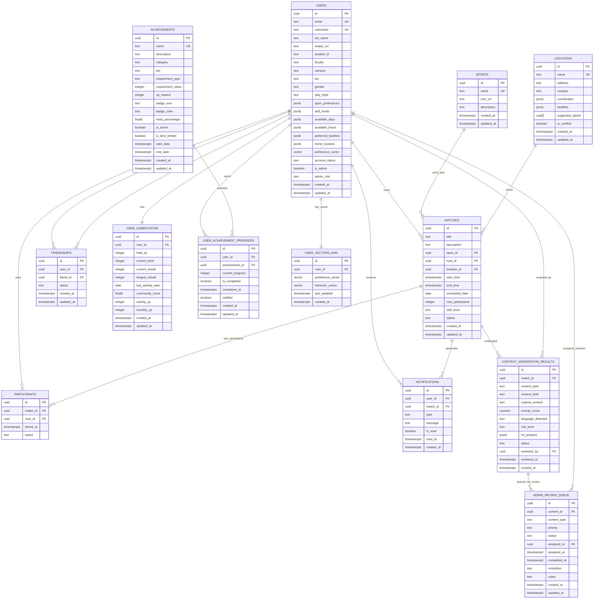

# Sportea Application - Entity Relationship Diagram (Mermaid)

This diagram shows the core entities and relationships in the Sportea application, excluding messaging and rating functionality that is not yet implemented.

## Entity Descriptions

### Core Business Entities

- **USERS**: Central entity storing user profiles, preferences, and authentication data
- **MATCHES**: Main business entity representing sports matches/games
- **SPORTS**: Reference data for different sports types
- **LOCATIONS**: Venue information for matches

### Bridge/Junction Tables

- **PARTICIPANTS**: Many-to-many relationship between users and matches
- **FRIENDSHIPS**: Many-to-many relationship for user connections
- **USER_ACHIEVEMENT_PROGRESS**: Many-to-many relationship between users and achievements with progress tracking

### Gamification & Leaderboard System

- **USER_GAMIFICATION**: Core leaderboard table with XP tracking, level progression, streaks, and time-based XP (weekly/monthly). Supports leaderboard functionality through the `simple_leaderboard` view which joins with USERS to provide ranked leaderboard data.
- **ACHIEVEMENTS**: Comprehensive achievement system with tiers, requirements, badges, and rarity
- **NOTIFICATIONS**: System alerts and messages

**Note**: Leaderboard functionality is implemented through the `USER_GAMIFICATION` table and a database view (`simple_leaderboard`) that joins user gamification data with user profile information to provide ranked leaderboard results. No separate leaderboard tables are used.

### Advanced Features

- **USER_VECTORS_KNN**: Machine learning vectors for recommendation system
- **CONTENT_MODERATION_RESULTS**: AI-powered content moderation
- **ADMIN_REVIEW_QUEUE**: Administrative workflow management

## Relationship Cardinalities

- **1:1** - One-to-one (e.g., User has one Gamification record)
- **1:M** - One-to-many (e.g., User hosts many Matches)
- **M:M** - Many-to-many (implemented via bridge tables)

## Key Features

1. **Professional ERD Notation**: Uses standard crow's foot notation
2. **Complete Schema**: All core entities without messaging/rating
3. **Proper Constraints**: Primary keys (PK), Foreign keys (FK), Unique keys (UK)
4. **Data Types**: Includes modern types like JSONB, VECTOR, TIMESTAMPTZ
5. **Scalable Design**: Supports recommendation systems and content moderation

## Excluded Entities

The following entities are excluded as they represent messaging/rating functionality not yet implemented:

- MESSAGES
- RATINGS  
- MATCH_INVITATIONS
- MATCH_JOIN_REQUESTS

This ERD provides a comprehensive view of the Sportea application's data architecture, focusing on the core sports matching, social, and gamification features.
