# Regular User Activity Diagram - Simplified Core Features

## Activity Diagram

```mermaid
flowchart TD
    Start([●]) --> Register[Register]
    Register --> RegSuccess{Register Success?}
    RegSuccess -->|No| Register
    RegSuccess -->|Yes| Login[Login]

    Login --> LoginSuccess{Login Success?}
    LoginSuccess -->|No| Login
    LoginSuccess -->|Yes| Dashboard[Dashboard]

    Dashboard --> CoreFeatures{Select Core Feature}

    %% Core Feature Branches
    CoreFeatures -->|Find Games| FindMatches[Find Matches]
    CoreFeatures -->|Host Game| HostMatch[Host Match]
    CoreFeatures -->|Profile| ManageProfile[Manage Profile]
    CoreFeatures -->|Friends| ManageFriends[Manage Friends]
    CoreFeatures -->|Leaderboard| ViewLeaderboard[View Leaderboard]

    %% Find Matches Flow
    FindMatches --> ViewMatchDetails[View Match Details]
    ViewMatchDetails --> JoinMatch[Join Match]
    JoinMatch --> EarnXP1[Earn XP]

    %% Host Match Flow
    HostMatch --> CreateMatch[Create Match]
    CreateMatch --> ContentMod[Content Moderation]
    ContentMod --> PublishMatch[Publish Match]
    PublishMatch --> EarnXP2[Earn XP]

    %% Profile Flow
    ManageProfile --> UpdateProfile[Update Profile]
    UpdateProfile --> ViewAchievements[View Achievements]

    %% Friends Flow
    ManageFriends --> AddFriends[Add Friends]
    AddFriends --> SocialInteraction[Social Interaction]

    %% Leaderboard Flow
    ViewLeaderboard --> CheckRanking[Check Ranking]
    CheckRanking --> TrackProgress[Track Progress]

    %% Convergence
    EarnXP1 --> Continue{Continue?}
    EarnXP2 --> Continue
    ViewAchievements --> Continue
    SocialInteraction --> Continue
    TrackProgress --> Continue

    Continue -->|Yes| Dashboard
    Continue -->|No| Logout[Logout]
    Logout --> End([●])

    %% Styling
    classDef startEnd fill:#000,stroke:#000,stroke-width:2px
    classDef process fill:#fff,stroke:#000,stroke-width:2px
    classDef decision fill:#fff,stroke:#000,stroke-width:2px

    class Start,End startEnd
    class Register,Login,Dashboard,FindMatches,HostMatch,ManageProfile,ManageFriends,ViewLeaderboard,ViewMatchDetails,JoinMatch,CreateMatch,ContentMod,PublishMatch,UpdateProfile,ViewAchievements,AddFriends,SocialInteraction,CheckRanking,TrackProgress,EarnXP1,EarnXP2,Logout process
    class RegSuccess,LoginSuccess,CoreFeatures,Continue decision
```

## Simplified Activity Diagram Description

### Overview
This simplified activity diagram shows the core user workflow in Sportea, focusing on the five main features: authentication, match finding, match hosting, profile management, friends management, and leaderboard viewing.

### Core Features Flow

#### 1. **Authentication**
- User registers or logs in to access the platform
- System validates credentials and redirects to dashboard

#### 2. **Core Features (5 Main Branches)**
- **Find Matches**: Browse and join available sports matches
- **Host Match**: Create new matches with content moderation
- **Manage Profile**: Update profile information and view achievements
- **Manage Friends**: Add friends and social interactions
- **View Leaderboard**: Check rankings and track progress

#### 3. **XP System**
- Users earn XP for joining and hosting matches
- Progress tracking through five-tier ranking system

#### 4. **Convergence**
- All activities converge to a continue decision
- Users can return to dashboard or logout
  1. Sport Selection (with player count guidelines)
  2. Match Details (title, description, skill requirements)
  3. Location Setting (venue and court information)
  4. Review and Confirmation
- **Content Moderation**: Automated ML screening with manual review fallback
- **Match Publication**: Approved matches become available to other users
- **XP Rewards**: Hosts earn experience points for successful match creation

#### 5. **Profile Management Workflow**
- **Three-Tab Interface**:
  - **Details Tab**: Personal information and preferences management
  - **Achievements Tab**: Progress tracking and achievement viewing
  - **Activity Tab**: Historical activity and match participation
- **Profile Editing**: Users can update personal information and preferences
- **Achievement Tracking**: System monitors progress toward various achievements

#### 6. **Friends Management Workflow**
- **Four-Tab System**:
  - **Friends List**: Current friends with profile viewing and management options
  - **Friend Requests**: Incoming requests with accept/decline functionality
  - **Sent Requests**: Outgoing friend requests tracking
  - **Blocked Users**: User blocking and unblocking management
- **Social Actions**: Profile viewing, friend removal, and blocking capabilities

#### 7. **Leaderboard and Gamification Workflow**
- **Ranking Visualization**: Five-tier system (Bronze to Diamond)
- **Filtering Options**:
  - **Timeframe**: All Time, This Month, This Week
  - **Group**: Global, Friends, Level Tier
- **Profile Navigation**: Clickable user profiles for detailed viewing
- **Progress Tracking**: XP and level progression monitoring

#### 8. **Notification System Workflow**
- **Notification Panel**: Centralized notification viewing
- **Real-time Updates**: Achievement notifications, match updates, friend activities
- **Read Status Management**: Mark notifications as read functionality

#### 9. **Reporting System Workflow**
- **Issue Reporting**: Users can report problems or inappropriate content
- **Report Categories**: Multiple categories for different types of issues
- **Admin Alerts**: System notifies administrators of user reports
- **Confirmation Feedback**: Users receive confirmation of report submission

#### 10. **Session Management**
- **Logout Confirmation**: Users confirm logout intention
- **Session Termination**: Secure logout with session cleanup
- **Return to Login**: Users redirected to authentication page

### Decision Points and Branching Logic

#### Critical Decision Points:
1. **Authentication Status**: Determines initial user flow
2. **Main Menu Selection**: Central routing for all user activities
3. **Content Moderation**: Automated approval vs. manual review
4. **User Interactions**: Join/leave matches, accept/decline friends
5. **Profile Management**: View vs. edit modes

#### Error Handling and Alternative Flows:
- **Login Failures**: Error display with retry capability
- **Content Flagging**: Manual admin review for inappropriate content
- **Validation Errors**: Form validation with user feedback
- **Network Issues**: Graceful degradation and retry mechanisms

### Integration Points

#### System Interactions:
- **Real-time Updates**: Live match availability and notification delivery
- **Gamification Engine**: XP calculation and achievement tracking
- **Content Moderation**: ML-powered content screening
- **Recommendation System**: Personalized match suggestions
- **Analytics Tracking**: User behavior monitoring for system improvement

#### External Dependencies:
- **Authentication Service**: Supabase-based user authentication
- **Database Operations**: Real-time data synchronization
- **Notification Service**: Push notification delivery
- **Content Moderation API**: ML-based content analysis

---
*Generated as part of Phase 3: Activity Diagram Creation*
*Date: July 13, 2025*
*Status: Complete - Regular User Workflow Documented*
