# SporteaV3 Main Use Case Diagram

## Use Case Diagram

```mermaid
graph LR
    %% System Boundary
    subgraph SporteaV3["SporteaV3 Sports Matching Platform"]
        %% Authentication Use Cases
        Login((Login to System))
        Register((Register Account))
        Logout((Logout from System))

        %% Core User Use Cases
        FindMatches((Find Matches))
        HostMatch((Host Match))
        JoinMatch((Join Match))
        ViewMatchDetails((View Match Details))

        %% Match Management Use Cases
        CreateMatch((Create Match))
        EditMatch((Edit Match))
        CancelMatch((Cancel Match))

        %% Profile & Social Use Cases
        ManageProfile((Manage Profile))
        ManageFriends((Manage Friends))
        ViewLeaderboard((View Leaderboard))

        %% Gamification Use Cases
        ViewAchievements((View Achievements))
        EarnXP((Earn XP))
        TrackProgress((Track Progress))

        %% Notification Use Cases
        ViewNotifications((View Notifications))
        SendNotifications((Send Notifications))
        ReceiveNotifications((Receive Notifications))

        %% Content & Safety Use Cases
        ReportIssue((Report Issue))
        ModerateContent((Moderate Content))

        %% Admin Use Cases
        ManageUsers((Manage Users))
        ViewAnalytics((View Analytics))
        HandleReports((Handle User Reports))
        ReviewContent((Review Content))
    end

    %% Actors positioned outside the system boundary
    User[👤 Regular User]
    Admin[👨‍💼 Admin User]
    System[🖥️ System]

    %% User Relationships
    User --- Login
    User --- Register
    User --- Logout
    User --- FindMatches
    User --- HostMatch
    User --- JoinMatch
    User --- ManageProfile
    User --- ManageFriends
    User --- ViewLeaderboard
    User --- ReportIssue
    User --- ViewAchievements
    User --- ViewNotifications

    %% Admin Relationships
    Admin --- Login
    Admin --- Logout
    Admin --- ManageUsers
    Admin --- ViewAnalytics
    Admin --- HandleReports
    Admin --- ReviewContent

    %% System Relationships
    System --- SendNotifications
    System --- ModerateContent
    System --- EarnXP
    System --- TrackProgress
    System --- ReceiveNotifications

    %% Include Relationships (dotted arrows)
    HostMatch -.->|<<include>>| CreateMatch
    HostMatch -.->|<<include>>| EditMatch
    HostMatch -.->|<<include>>| CancelMatch

    FindMatches -.->|<<include>>| ViewMatchDetails
    JoinMatch -.->|<<include>>| ViewMatchDetails

    ManageProfile -.->|<<include>>| ViewAchievements
    ViewLeaderboard -.->|<<include>>| TrackProgress
    ViewNotifications -.->|<<include>>| ReceiveNotifications

    %% Extend Relationships (dashed arrows)
    CreateMatch -.->|<<extend>>| ModerateContent
    JoinMatch -.->|<<extend>>| EarnXP
    HostMatch -.->|<<extend>>| EarnXP
    HandleReports -.->|<<extend>>| ReviewContent
    ReportIssue -.->|<<extend>>| SendNotifications

    %% Styling
    classDef actor fill:#e1f5fe,stroke:#01579b,stroke-width:3px,color:#000
    classDef usecase fill:#ffffff,stroke:#4a148c,stroke-width:2px,color:#000
    classDef system fill:#e8f5e8,stroke:#1b5e20,stroke-width:3px,color:#000
    classDef boundary fill:#f8f9fa,stroke:#6c757d,stroke-width:2px,stroke-dasharray: 5 5

    class User,Admin actor
    class System system
    class Login,Register,Logout,FindMatches,HostMatch,JoinMatch,ManageProfile,ManageFriends,ViewLeaderboard,ReportIssue,ViewAchievements,ManageUsers,ViewAnalytics,HandleReports,ReviewContent,CreateMatch,EditMatch,CancelMatch,ViewMatchDetails,SendNotifications,ModerateContent,EarnXP,TrackProgress,ViewNotifications,ReceiveNotifications usecase
    class SporteaV3 boundary
```

## Use Case Overview

### Primary Actors
1. **Regular User**: Students who use the platform to find and participate in sports activities
2. **Admin User**: Administrative staff who manage the platform and moderate content
3. **System**: Automated system processes for notifications, moderation, and gamification

### Core Use Case Categories

#### 1. Authentication & Access Management
- User registration and login
- Session management and logout
- Profile authentication

#### 2. Match Management
- Finding available matches with filtering and recommendations
- Hosting new matches with detailed configuration
- Joining existing matches
- Managing hosted matches (edit, cancel)

#### 3. Social Features
- Friend management (add, remove, block)
- Profile management and customization
- Leaderboard viewing and competition

#### 4. Administrative Functions
- User management and oversight
- Analytics and reporting
- Content moderation and review
- User report handling

#### 5. Gamification & Engagement
- XP earning and level progression
- Achievement tracking
- Progress monitoring
- Tier-based competition

#### 6. Content & Safety
- Issue reporting system
- Automated content moderation
- Manual content review
- User behavior monitoring

#### 7. Communication & Notifications
- Real-time notification system
- Achievement notifications
- Match updates and alerts

### Key Relationships

#### Include Relationships (<<include>>)
- **Host Match** includes Create Match, Edit Match, Cancel Match
- **Find Matches** includes View Match Details
- **Join Match** includes View Match Details
- **Manage Profile** includes View Achievements
- **View Leaderboard** includes Track Progress
- **View Notifications** includes Receive Notifications

#### Extend Relationships (<<extend>>)
- **Create Match** extends to Moderate Content (automatic content screening)
- **Join Match** extends to Earn XP (gamification reward)
- **Host Match** extends to Earn XP (gamification reward)
- **Handle Reports** extends to Review Content (when reports involve content issues)
- **Report Issue** extends to Send Notifications (admin alerts)

### System Integration Points
- Real-time notifications for user activities
- Automated content moderation using ML
- XP and achievement tracking
- Progress monitoring and analytics

---
*Generated as part of Phase 2: Use Case Diagram Creation*
*Date: July 13, 2025*
