# Admin User Activity Diagram - Simplified Core Features

## Activity Diagram

```mermaid
flowchart TD
    Start([●]) --> AdminLogin[Admin Login]
    AdminLogin --> LoginSuccess{Login Success?}
    LoginSuccess -->|No| AdminLogin
    LoginSuccess -->|Yes| AdminDashboard[Admin Dashboard]

    AdminDashboard --> AdminFeatures{Select Admin Feature}

    %% Core Admin Feature Branches
    AdminFeatures -->|Overview| ViewOverview[View Overview]
    AdminFeatures -->|Users| ManageUsers[Manage Users]
    AdminFeatures -->|Matches| ViewAnalytics[View Analytics]
    AdminFeatures -->|Feedback| ManageFeedback[Manage Feedback]
    AdminFeatures -->|Content| ModerateContent[Moderate Content]

    %% Overview Flow
    ViewOverview --> MonitorMetrics[Monitor Metrics]
    MonitorMetrics --> SystemHealth[Check System Health]

    %% User Management Flow
    ManageUsers --> ReviewReports[Review User Reports]
    ReviewReports --> ResolveIssues[Resolve Issues]

    %% Analytics Flow
    ViewAnalytics --> AnalyzeData[Analyze Match Data]
    AnalyzeData --> GenerateReports[Generate Reports]

    %% Feedback Flow
    ManageFeedback --> ReviewFeedback[Review User Feedback]
    ReviewFeedback --> OptimizeSystem[Optimize System]

    %% Content Moderation Flow
    ModerateContent --> ReviewQueue[Review Moderation Queue]
    ReviewQueue --> ApproveReject[Approve/Reject Content]

    %% Convergence
    SystemHealth --> Continue{Continue?}
    ResolveIssues --> Continue
    GenerateReports --> Continue
    OptimizeSystem --> Continue
    ApproveReject --> Continue

    Continue -->|Yes| AdminDashboard
    Continue -->|No| AdminLogout[Admin Logout]
    AdminLogout --> End([●])

    
    %% Styling
    classDef startEnd fill:#000,stroke:#000,stroke-width:2px
    classDef process fill:#fff,stroke:#000,stroke-width:2px
    classDef decision fill:#fff,stroke:#000,stroke-width:2px

    class Start,End startEnd
    class AdminLogin,AdminDashboard,ViewOverview,ManageUsers,ViewAnalytics,ManageFeedback,ModerateContent,MonitorMetrics,SystemHealth,ReviewReports,ResolveIssues,AnalyzeData,GenerateReports,ReviewFeedback,OptimizeSystem,ReviewQueue,ApproveReject,AdminLogout process
    class LoginSuccess,AdminFeatures,Continue decision
```

## Admin User Activity Diagram Description

### Overview
This simplified admin activity diagram shows the core administrative workflow in Sportea, following a structured three-tier activity flow with parallel processing and synchronization points. The diagram represents the essential admin journey from authentication through comprehensive platform management, demonstrating how administrators monitor, manage, and moderate the entire Sportea ecosystem.

### Detailed Activity Flow Analysis

#### **1. Initial Flow - Admin Authentication Sequence**

**Start Node (●)**
- **Purpose**: Entry point representing admin initiation of the Sportea admin portal
- **Trigger**: Admin navigates to `/admin` URL or accesses admin interface
- **System State**: Admin portal loads with dedicated authentication interface

**Admin Login Activity**
- **Function**: Secure admin authentication process with elevated privileges
- **Input Requirements**: Admin email credentials and password
- **Authentication**: Validates admin-level access permissions
- **Security Features**: Enhanced security for administrative access
- **Interface**: Dedicated admin login page with "Sportea Analytics Dashboard" branding

**Login Success Decision (Diamond)**
- **Evaluation Criteria**: Successful admin credential verification and permission validation
- **Yes Path**: Proceeds to admin dashboard with full administrative privileges
- **No Path**: Returns to admin login with error feedback and security logging
- **Security Measures**: Failed admin login attempts are logged for security monitoring

**Admin Dashboard Activity**
- **Central Command Center**: Main administrative interface displaying system overview
- **Key Metrics Display**: Shows critical platform statistics (Total Users: 4, Total Matches: 19, Participations: 20, Feedback Score: 0)
- **Navigation Hub**: Provides access to all administrative functions
- **Real-time Monitoring**: Displays live system health and activity metrics

#### **2. Core Administrative Features (Five Main Branches)**

**View Overview Activity**
- **System Monitoring**: Comprehensive dashboard showing platform health and key performance indicators
- **Metrics Tracking**: Displays user growth (+2 new), match activity (+19 new), participation rates (+20 new)
- **Alert Management**: Shows system alerts and notifications requiring admin attention
- **Performance Indicators**: Real-time monitoring of platform performance and user engagement

**Manage Users Activity**
- **User Report Management**: Comprehensive interface for handling user-submitted reports
- **Report Categories**: Handles player reports, technical issues, and user behavior concerns
- **Status Tracking**: Manages report lifecycle (Open, In Progress, Resolved)
- **Resolution Tools**: Provides admin tools for investigating and resolving user issues
- **Statistics Display**: Shows Total Reports: 2, Open Reports: 0, In Progress: 0, Resolved: 0

**View Analytics Activity**
- **Match Analytics**: Comprehensive match statistics and performance metrics
- **Key Performance Indicators**: Total Matches: 19, Active Matches: 3, Completion Rate: 11%, Avg Participants: 1.1
- **Sport-wise Analysis**: Detailed breakdown by sport (Basketball: 16% popularity, Badminton: 11% popularity)
- **Trend Analysis**: Match creation trends over time with visual charts and graphs
- **Data Visualization**: Charts showing match status distribution and creation patterns

**Manage Feedback Activity**
- **Feedback Analytics**: Comprehensive feedback monitoring and analysis system
- **Algorithm Performance**: Tracks recommendation algorithm effectiveness (Direct Preference, Collaborative Filtering, Activity Based)
- **Satisfaction Metrics**: Monitors user satisfaction rates and feedback scores
- **Trend Analysis**: Weekly feedback trends and pattern identification
- **Performance Optimization**: Data-driven insights for system improvements

**Moderate Content Activity**
- **ML-Powered Moderation**: Integration with Toxic-Bert content moderation system
- **Auto-Approval Metrics**: 87% auto-approval rate with 13 auto-approved items
- **Manual Review Queue**: Management of content requiring human review
- **Risk Assessment**: High-risk content identification (1 item requiring immediate attention)
- **Moderation Statistics**: Total Moderated: 15 items this week

#### **3. Second Tier - Specialized Administrative Actions**

**Monitor Metrics Activity**
- **Real-time Monitoring**: Continuous tracking of system performance indicators
- **Health Checks**: Automated system health monitoring and alert generation
- **Performance Analysis**: Deep dive into platform performance metrics
- **Trend Identification**: Pattern recognition in user behavior and system usage

**Review Reports Activity**
- **Report Investigation**: Detailed analysis of user-submitted reports
- **Evidence Gathering**: Comprehensive review of reported incidents and user behavior
- **Priority Assessment**: Categorization of reports by urgency and impact
- **Resolution Planning**: Strategic approach to resolving user concerns and platform issues

**Analyze Data Activity**
- **Statistical Analysis**: Deep analysis of match data, user engagement, and platform usage
- **Performance Metrics**: Comprehensive evaluation of platform effectiveness
- **Trend Analysis**: Identification of usage patterns and growth opportunities
- **Report Generation**: Creation of detailed analytics reports for stakeholders

**Review Feedback Activity**
- **Feedback Assessment**: Systematic review of user feedback and satisfaction data
- **Algorithm Evaluation**: Analysis of recommendation system performance
- **User Experience Analysis**: Understanding user satisfaction and pain points
- **Improvement Identification**: Data-driven insights for platform enhancements

**Review Queue Activity**
- **Content Moderation**: Manual review of content flagged by ML systems
- **Quality Assurance**: Human oversight of automated moderation decisions
- **Policy Enforcement**: Ensuring content compliance with platform guidelines
- **Decision Making**: Approve/reject decisions for questionable content

#### **4. Third Tier - Outcome and Resolution Activities**

**Check System Health Activity**
- **Infrastructure Monitoring**: Comprehensive system health assessment
- **Performance Validation**: Verification of system performance and reliability
- **Issue Detection**: Early identification of potential system problems
- **Preventive Maintenance**: Proactive system maintenance and optimization

**Resolve Issues Activity**
- **Problem Resolution**: Systematic resolution of identified platform issues
- **User Support**: Direct intervention in user-reported problems
- **System Fixes**: Implementation of solutions for technical and user experience issues
- **Documentation**: Comprehensive logging of issue resolution for future reference

**Generate Reports Activity**
- **Analytics Reporting**: Creation of comprehensive platform performance reports
- **Stakeholder Communication**: Detailed reports for management and development teams
- **Data Export**: Exportable analytics data for external analysis
- **Performance Documentation**: Historical tracking of platform metrics and improvements

**Optimize System Activity**
- **Performance Enhancement**: Implementation of system optimizations based on feedback analysis
- **Algorithm Tuning**: Refinement of recommendation algorithms based on user feedback
- **User Experience Improvements**: Platform enhancements driven by user satisfaction data
- **Efficiency Improvements**: System optimizations for better performance and user experience

**Approve/Reject Content Activity**
- **Content Decision Making**: Final approval or rejection of flagged content
- **Policy Enforcement**: Ensuring content compliance with platform standards
- **User Communication**: Notification of content moderation decisions to users
- **Quality Control**: Maintaining high content quality standards across the platform

#### 8. **System Configuration Management**
- **User Settings**: Manage global user preferences and restrictions
- **Content Policies**: Update community guidelines and content rules
- **ML Parameters**: Configure machine learning model settings
- **Notification Management**: Control system notification settings and templates

#### 9. **Emergency Response System**
- **User Account Suspension**: Immediate user account deactivation for policy violations
- **Content Removal**: Emergency content takedown for inappropriate material
- **Maintenance Mode**: System-wide maintenance mode activation
- **Feature Disabling**: Temporary feature deactivation for critical issues
- **Action Logging**: Comprehensive audit trail for all emergency actions
- **Stakeholder Notification**: Automatic alerts to relevant team members

#### 10. **Reporting and Analytics**
- **Report Type Selection**:
  - **User Activity Reports**: User engagement and behavior analytics
  - **Match Analytics Reports**: Match creation, participation, and completion statistics
  - **Content Moderation Reports**: Moderation queue performance and content analysis
  - **System Performance Reports**: Technical performance and system health metrics
- **Export Functionality**: Download reports in various formats for external analysis

### Decision Points and Administrative Logic

#### Critical Decision Points:
1. **Authentication Validation**: Secure admin access control
2. **Report Prioritization**: Urgent vs. routine report handling
3. **Content Moderation**: Approve, reject, or flag content decisions
4. **Emergency Response**: Type and severity of emergency actions
5. **Algorithm Optimization**: Performance-based parameter adjustments

#### Administrative Workflows:
- **Escalation Procedures**: Clear pathways for complex issue resolution
- **Approval Processes**: Multi-step approval for significant system changes
- **Audit Trails**: Comprehensive logging of all administrative actions
- **Quality Assurance**: Review and validation of administrative decisions

### Integration Points and System Dependencies

#### Real-time Monitoring:
- **System Health Dashboards**: Live performance metrics and alerts
- **User Activity Tracking**: Real-time user behavior monitoring
- **Content Flow Monitoring**: Track content through moderation pipeline
- **Alert Systems**: Immediate notification of critical issues

#### External System Integration:
- **ML Content Moderation**: Integration with machine learning services
- **Analytics Platforms**: Data export to external analytics tools
- **Notification Services**: Email and push notification systems
- **Audit Systems**: Compliance and audit trail management

#### Security and Compliance:
- **Access Control**: Role-based permissions and security validation
- **Data Protection**: Secure handling of user data and privacy compliance
- **Audit Compliance**: Comprehensive logging for regulatory requirements
- **Emergency Protocols**: Rapid response procedures for security incidents

### Performance and Scalability Considerations

#### Efficiency Optimization:
- **Batch Processing**: Efficient handling of large data sets
- **Caching Strategies**: Optimized data retrieval for dashboard performance
- **Load Balancing**: Distributed processing for high-volume operations
- **Resource Management**: Optimal allocation of system resources

#### Scalability Features:
- **Modular Architecture**: Scalable admin function modules
- **API Integration**: RESTful APIs for external tool integration
- **Database Optimization**: Efficient queries for large-scale data analysis
- **Cloud Infrastructure**: Scalable cloud-based administrative tools

---
*Generated as part of Phase 3: Activity Diagram Creation*
*Date: July 13, 2025*
*Status: Complete - Admin User Workflow Documented*
