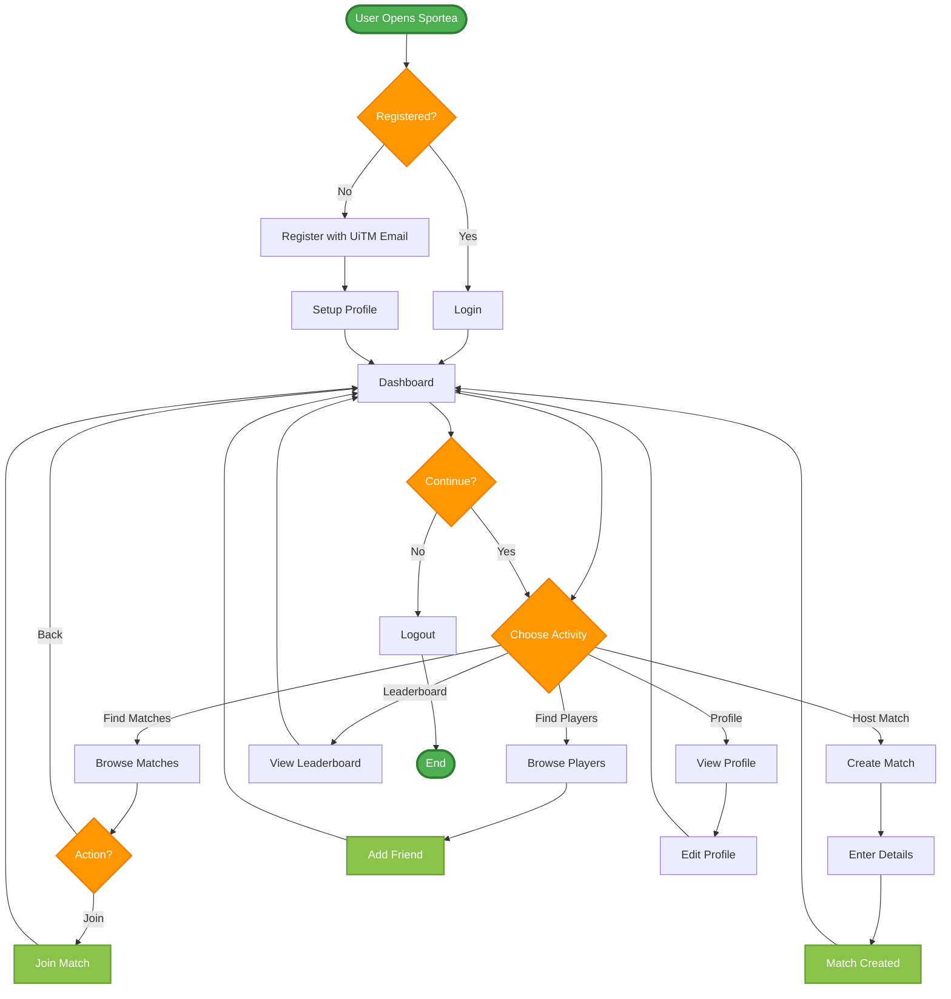

# Sportea Application - User Activity Diagram (Simplified)

## Core User Journey

This simplified diagram shows the essential user flows in Sportea:

### Main Flows:
1. **Authentication**: Register/Login → Profile Setup → Dashboard
2. **Match Activities**: Browse Matches → Join OR Create Match
3. **Social**: Find Players → Add Friends
4. **Profile**: View/Edit Profile
5. **Gamification**: View Leaderboard
6. **Session**: Continue or Logout

### Key Features:
- **One-page overview** of core functionality
- **Essential user decisions** only
- **Streamlined paths** without detailed sub-flows
- **Focus on primary actions** users perform daily
